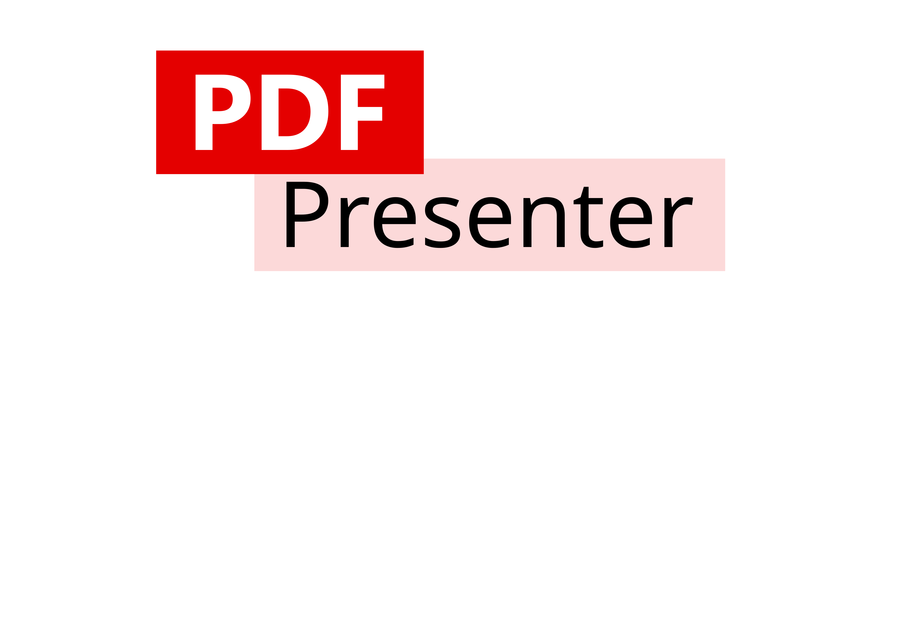

# PDF Presenter



This tool purpose is to replicate the *Presenter Mode* of MS PowerPoint for PDF files, and especially for LaTeX presentation.

## About this tool

The *Presentor Mode* of MS PowerPoint is great, but MS PowerPoint sucks! As presentation made with [LaTeX](https://www.latex-project.org/) are more professional, the only way to present them was using a PDF viewer and put it in full-screen. With two displays, them would output the same thing: the current page the presentation file. We assume that the presenter has the display of its own computer, and uses an external display to actually displays the presentation. We wanted to take advantage of the presenter's display, by displaying useful pieces of information like in MS PowerPoint. These are, but are not limited to:
- The current slide;
- The next slide;
- The local time;
- A chronometer;
- Notes for each slide.

Although, there is already another tool available called [Showcase PDF](https://github.com/russkyc/showcase-pdf). We made abstraction of the availability of this piece of software, since it must convert each slide (each PDF page) to an image, and is written in C# needing [Microsoft's SDK](https://dotnet.microsoft.com/en-us/download) to be installed on the running computer.

The goal with this project is to offer a simple, fast, powerful and native tool to present your PDF files.

## How to use it?

PDF Presenter does accept command-line arguments. The first argument is a relative/absolute path to the PDF path to open. The second argument is a relation/absolute path to the notes file to open. The notes file must be a MarkDown or a text file.

In order to display appropriate notes on each slide in the notes section, PDF Presenter parses the notes file and looks for a delimiter. In a MarkDown file, the delimiter is `\n# `. In a text file, the delimiter is `\n---\n`. We plan to implement a feature letting the user choose a custom delimiter for any file.

To get help, use the `-h` or `--help` as first command line argument.

``` text
$ pdf-presenter -h
PDF Presenter
Maintainer: Andrei Zeucianu
GitHub repository: https://github.com/Androl404/pdf-presenter

Usage:
    pdf-presenter [pdf_file.pdf] [notes_file.{txt,md}]

Help:
    -h, --help       Show this help message
    -v, --version    Show this software's version
```

PDF presenter also has a monitors list allowing you to choose on which window to put the presentation window. The presentation window is automatically put in full-screen mode, but you can revert that with your window manager and move the window wherever you want.

## Getting this tool
### Building it from source code
#### Building on Unix like operating systems

The main dependencies of this project are `gtk4`, `poppler` and `cairo`. The development files of these libraries must be installed on your system. For instance, to install these packages on Debian, you would run:

``` shell
# apt install libgtk-4-dev libcairo2-dev libpoppler-dev libpoppler-glib-dev
```

On different Unix like operating systems, please refer to your operating system documentation and to your package manager.

After that, you only need to run a few commands in order to compile and run PDF Presenter:

```shell
$ git clone https://github.com/Androl404/pdf-presenter
$ cd pdf-presenter
$ ./build.sh
$ ./build/pdf-presenter
```

In order to clean the project, simply run:
```shell
$ ./build.sh clean
```

This will delete the `build` folder at the root of the repository, containing only the final executable of PDF Presenter.

> [!NOTE]
> This project does not natively support MacOS, but we welcome changes to add support for new targets!

> [!TIP]
> FreeBSD is supported and the `build.sh` file also runs on that operating system.

#### Building on MS Windows

Building on MS Windows is a little bit trickier, but is supported this project. We recommend installing [msys2](https://www.msys2.org/) which is a collection of tools and libraries with an easy-to-use environment for building, installing and running native Windows software. After installing that dependency, open the start menu and search for MSYS2 MINGW64. Run the following commands to update msys2 and to install all the required dependencies:

```sh
$ pacman -Suy
$ pacman -S mingw-w64-x86_64-gtk4 mingw-w64-x86_64-gcc pkgconf mingw-w64-x86_64-poppler mingw-w64-x86_64-glib2
```

After the installation has succeeded, you must add the following folder `C:\msys64\mingw64\bin` to the Windows path as first element. Restart your computer, reopen the same console and go to your C drive (`cd /c/`) in the folder you want to clone this project. Then, follow the *Unix like operating system* instructions to build this project.

### Pre-built binaries

*Pre-built binaries will be available soon in the [release page](https://github.com/Androl404/pdf-presenter/releases).*

## Screenshots

## Contributing

Any contribution is welcome. Please file a Pull Request describing the changes you want to merge. This project tries to follow the [Conventional Commits](https://www.conventionalcommits.org/en/v1.0.0/) convention, although we are quite flexible with the commits message, while it does its best to describe the change which is made.

## Licence

See the [LICENCE](./LICENSE) file. In short, this project is licensed under the MIT license.
